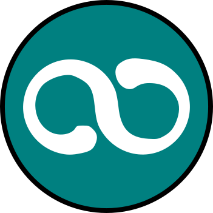

# Project Euler

 

> **[Project Euler](https://projecteuler.net)** é um bom site de desafios onde as tarefas apresentadas são boas para quem já possui uma base de programação e procura apreender um nova linguagem ou como ir um passo além e otimizar um processo através de passos matemáticos.

## Tarefas
Tomei a liberdade de copiar os enunciados e em alguns casos alterá-lo para maior clareza. Qualquer dúvida os enunciados podem ser conferidos na integra no site do projeto, o número do problema é linkado no nome do arquivo.

Todos os status serão seguidos por uma explicação referente a última alteração no código.

Todas as atividades foram implementadas nas linguagens que os diretórios representam. Até agora:

* [Ruby](https://www.ruby-lang.org)
* [C++](http://www.cplusplus.com)
* [Julia](https://julialang.org/)
* [Go](https://golang.org/)
* [Haskell](https://haskell-lang.org/)
* [Python](https://www.python.org/)

### Andamento
Nem todas as tarefas estão finalizadas e mais em algumas linguagens do que em outras. Este é um projeto de aprendizado e considero um dos poucos que levarei para a vida

### Dependências
As tarefas estão organizadas em pastas de acordo as conquistas desbloqueadas, que são a cada 25 realizadas. Além disso, quando o exercício precisar de algum arquivo de texto com inputs ele se econtrará em uma pasta nomeada _input_ e o com o __.txt__ nomeado referente ao exercício.

#### Instalações
Algumas implementações podem requerer pacotes da linguagem que eu acabei instalando, procure ver os _imports_ antes de rodar o programa e, qualquer coisa, procure ver como instalar aquele pacote em expecífico.

## Referências
Além disso, todas as referências utilizadas também estarão igualmente listadas ao final de cada descrição. Seja ela desde uma página da que eu utilizei para entender melhor o conceito por trás da tarefa, uma página de outras pessoas que já realizaram tais tarefas, ou teoria matemática.

Alguns sites comumente utilzados:

* [Wikipédia](https://www.wikipedia.org)
* [MathBlog](http://www.mathblog.dk/category/solutions/project-euler/)
* [StackOverflow](https://stackoverflow.com/)
* [Mathematics](https://math.stackexchange.com/)
* [Theorical Computer Science](https://cstheory.stackexchange.com/)

Talvez algum dia eu irei rodar benchmarks comparando a performance das linguages para cada caso de teste, então publicarei.

## Código
Procuro sempre comentar os códigos, em Inglês, para que a leitura seja de maneira mais clara. Todavia, normalmente o faço depois que termino a tarefa.

Qualquer dúvida só avisar

## Licença
Veja o arquivo [LICENSE](../../LICENSE).

## Autores
* Apenas [eu](https://github.com/Fazendaaa)

E pretendo continuar assim porque este projeto é para desenvolvimento pessoal. Mas fique a vontade para fazer fork dele e modificar as implementações como achar necessário e acabar criando a sua tomando passos diferentes dos meus.

## Contribuindo
Não abrirei o projeto para nenhum Pull Request (PR), porém se encontrar algum problema ao rodar os problemas, sejam eles com dependencias ou minha solução foi muito orientada ao input, se sinta a vontade de me avisar que eu procurarei corrigir isso e darei sim o mérito a você que me ajudou com isso.
